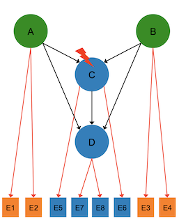
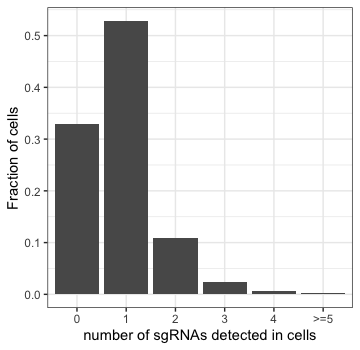
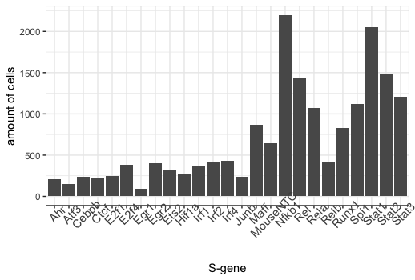
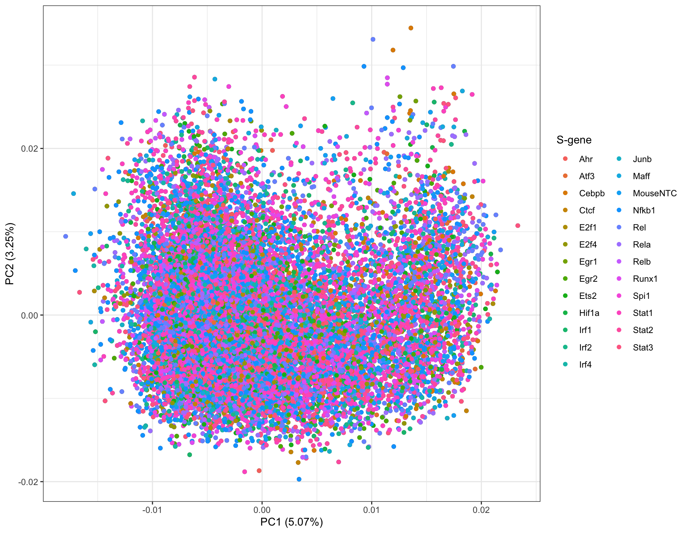

# Causal Inference of Gene Networks with a Mixture Nested Effects Model

This is a data analysis project using [mixture nested effect model (M&NEM)](https://academic.oup.com/bioinformatics/article/34/17/i964/5093248) implemented in an R package [mnem](https://www.bioconductor.org/packages/release/bioc/html/mnem.html#:~:text=Mixture%20Nested%20Effects%20Models%20(mnem,et%20al.%2C%202017).&text=The%20mixture%20components%20are%20inferred%20via%20an%20expectation%20maximization%20algorithm.) to infer causal networks of transcription factors from single cell RNA sequencing (sc-RNAseq) data in perturbation (gene knock-down) experiments. 

The folder *code* contains *main.R*, the R code used in this project, and *utilities.R*, all the functions used in *main.R*. I uploaded the pre-processed data in *result/data*, and all the figures to demonstrate the result of the data analysis in *result/figures*.

## NEM and M&NEM introduction

Gene signaling pathways are essential to understand cells in normal and diseased states. Nested Effects Models (NEM) can be used to decipher gene signaling pathways from perturbation experiments. In such experiments, a signaling gene (S-gene) is knocked down and the effect on a range of other genes (E-genes) can be obtained from high-throughput gene expression data. Comparing to the control group, where no S-gene is perturbed, if the expression level of an E-gene *j* changes under the perturbation of S-gene *i*, then S-gene *i* has an effect on E-gene *j*. If the set of E-genes that S-gene *i* has an effect on is a subset of the E-genes that S-gene *k* has an effect on, then we can conclude that gene *i* is downstream of gene *k* in the gene signaling network, and draw a causal edge from gene *k* to gene *i*. 


*This is a picture from the lecture given by Dr. Martin Pirkl and Prof. Niko Beerenwinkel, the authors of the MNEM paper.*

The figure above shows four S-genes: A,B,C and D, and their interactions in black arrows, which we cannot observe and try to infer. Each S-gene has effects on two E-genes, shown in orange arrows, which we can observe. For example, S-gene A affects E-genes E1 and E2, and S-gene B affects E-genes E3 and E4. Now, when S-gene C is knocked down, we observe effects in E-genes E5, E6 (its own E-genes) and also E7, E8 (the E-genes of S-gene D, which S-gene C "secretly" controls but we cannot observe). When S-gene D is knocked down, we observe an effect only in E-genes E7 and E8. Since E7 and E8 is a subset of E5, E6, E7 and E8, we infer that D is downstream of C.

NEM solves the gene network of S-genes (i.e., the black arrows), and how E-genes from the gene expression data is attached to the S-genes (i.e., the orange arrows). We assume that each E-gene attaches (i.e., responds) to at most one S-gene. 

However, NEM can only infer one single gene network, ignoring the possible heterogeneity in the cell population. Distinct causal gene networks may co-exist in the sub-populations. It is important to consider cell heterogeneity, since sub-populations of cells could behave differently, as shown in studies on cancer and neuodegeneration. M&NEM can solve *K* signaling pathways, or components, in a cell population. Each component *k* has its mixture weight that sums up to 1 with the weights of all other components. Similar to NEM, M&NEM infers the gene networks by maximizing the log likelihood of the data with an Expectation maximization (EM) algorithm.

## The dataset

In this project, we choose a dataset from a [Perturb-Seq study](https://www.ncbi.nlm.nih.gov/pmc/articles/PMC5181115/) that involves 24 transcription factors (S-genes). They knocked down the genes in bone marrow dendritic cells with small guide RNAs (sgRNAs) introduced by CRISPR lentiviral vectors, and exposed 32777 cells to lipopolysaccharide (LPS) for three hours. The effects of S-gene perturbations on the expression levels of 17775 genes (E-genes) were measured by single cell RNA sequencing (scRNA-seq). The data can be downloaded from the BROAD single-cell portal from [this link](https://singlecell.broadinstitute.org/single_cell/study/SCP24/perturb-seq#study-download). 

We need the following files: 
>GSM2396856_dc_3hr.mtx.txt 

This contains the gene expression profiles of the cells from sc-RNAseq. The 17775 E-genes are in rows and the 32777 cells are in columns. 

>GSM2396856_dc_3hr_cellnames.csv

This contains the names of the 32777 cells.

>GSM2396856_dc_3hr_cbc_gbc_dict_strict.csv

This contains the association between cell names and which S-gene is knocked down in each of the cells. Each sgRNA for the knock-down of a trascription factor (S-gene) has a list of the names of the cells in which this sgRNA is found. The name of the S-gene is contained in the name of the sgRNA. Note that several different sgRNAs may have been used for knocking down the same S-gene.

## Project description 


A detailed description of the project can be found in report.pdf. In short, 


We first load the raw data matrix, GSM2396856_dc_3hr.mtx.txt, and only induce rows (E-genes) with median expression value not less than 1 to reduce some noise from non-responsive E-genes. Then, we find for each cell, which S-gene is perturbed (knocked down). Since this project focuses on single perturbation effects, we only include cells (columns) with exactly one sgRNA detected, and we rename the columns of the data matrix as the perturbed S-gene in each cell. 

Then, we use the R package Linnorm, which is tailored for normalizing and transforming scRNA-seq data for precise downstream statistical analysis. It normalizes the data by conversion into relative scale, removes technical noises such as low count and highly variable genes that are typical to scRNA-seq, and transforms the data with a logarithm.

The above procedures are organized in one function, *preprocessData*. Like all other functions, it can be found in *code/utilities.R*. It reads the three data files downloaded into *data.path*, and we can set *plot.distribution = True* to plot the distribution of number of sgRNAs detected in cells and look at how S-genes are distributed among cells with only one perturbed S-gene.

First, we need to import all the libraries needed for the project:

```R
library(Matrix,Linnorm,ggplot2,ggfortify,gridExtra,ks,snowfall,mnem,umap,ggpubr,Rtsne)

```
Now, we call *preprocessData* to get our normalized transformed data matrix and look at how number of sgRNAs are detected in all the cells. 
```R
normalized.transformed.data <- preprocessData(data.path = 'your_path', plot.distribution = True)
```


<br>*Distribution of number of sgRNAs detected in cells.*

We can see that only over a half of cells can be included, since they have exactly one sgRNA detected, i.e., one S-gene perturbed. 


<br>*Distribution of S-gene perturbations among cells with single sgRNA. The particular S-gene knocked down in each cell was identified with a unique sgRNA. MouseNTC is the non-targeting negative control.*

And cells containing one sgRNA showed uneven distribution over the particular S-genes perturbed. There are over 2000 cells perturbed with *Nfkb1* or *Spi1*, but more than half of the perturbed S-genes have less than 500 cells.

We can see from below that if we use normal PCA for dimension reduction, then the first two components explain little of the total variance, and data shows no clustering. 

```R
# do PCA on processed count data and visualize
nor.trans.pca <- prcomp(t(normalized.transformed.data))
autoplot(nor.trans.pca) + geom_point(aes(color=colnames(normalized.transformed.data))) + 
        theme_bw() + scale_color_discrete(name='S-gene')
```

<br>*PCA on normalized transformed data*

When we use UMAP, or Uniform Manifold Approximation and Projection instead, we see 