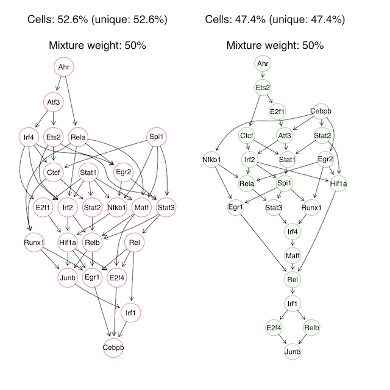
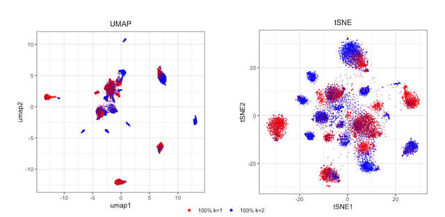

# Causal Inference of Gene Networks with a Mixture Nested Effects Model

This is a data analysis project using [mixture nested effect model (M&NEM)](https://academic.oup.com/bioinformatics/article/34/17/i964/5093248) implemented in the R package [mnem](https://www.bioconductor.org/packages/release/bioc/html/mnem.html#:~:text=Mixture%20Nested%20Effects%20Models%20(mnem,et%20al.%2C%202017).&text=The%20mixture%20components%20are%20inferred%20via%20an%20expectation%20maximization%20algorithm.) to infer causal networks of transcription factors from single cell RNA sequencing (sc-RNAseq) data in perturbation (gene knock-down) experiments. 

The R code used in this project is in *code/main.R* and all the functions used in *main.R* are in *code/utilities.R*. I uploaded the pre-processed data in *result/data*, and some figures to demonstrate the project in *result/figures*.

## M&NEM introduction

Gene signaling pathways are essential to understand cells in normal and diseased states. Nested Effects Models (NEM) can be used to decipher gene signaling pathways from perturbation experiments. In such experiments, a signaling gene (S-gene) is knocked down and the effect on a range of other genes (E-genes) can be obtained from high-throughput gene expression data. Comparing to the control group, where no S-gene is perturbed, if the expression level of an E-gene *j* changes under the perturbation of S-gene *i*, then S-gene *i* has an effect on E-gene *j*. If the set of E-genes that S-gene *i* has an effect on is a subset of the E-genes that S-gene *k* has an effect on, then we can conclude that gene *i* is downstream of gene *k* in the gene signaling network, and draw a causal edge from gene *k* to gene *i*. 

The figure above is adopted from a lecture given by Dr. Martin Pirkl and Prof. Niko Beerenwinkel, the authors of the M&NEM paper. It shows four S-genes: A,B,C and D. Their interactions are in black arrows, which we cannot observe and try to infer. Each S-gene has effects on two E-genes, shown in orange arrows, which we can observe. For example, S-gene C affects E-genes E5 and E6, and S-gene D affects E-genes E7 and E8. When S-gene C is knocked down, we observe effects in E-genes E5, E6 (its own E-genes) and also E7, E8 (the E-genes of S-gene D, which is downstream of C but we cannot observe). When S-gene D is knocked down, we observe an effect only in E-genes E7 and E8. Since E7 and E8 is a subset of E5, E6, E7 and E8, we infer that D is downstream of C.

NEM solves the gene network of S-genes (i.e., the black arrows), and how E-genes from the gene expression data is attached to the S-genes (i.e., the orange arrows). However, NEM can only infer one single gene network, ignoring the possible heterogeneity in the cell population. Distinct causal gene networks may co-exist in the sub-populations. It is important to consider cell heterogeneity, since sub-populations of cells could behave differently, as shown in studies on cancer and neuodegeneration. M&NEM can solve *K* signaling pathways, or components, in a cell population. Each component *k* has its mixture weight. The weights of all components sum up to 1. Each cell has a responsibility for each component, and the responsibilities of each cell also sums up to 1. For example, a cell can have 30% probability (responsibility) of belonging to component 1, and 70% probability of belonging to component 2, if the whole dataset is split into two components. Similar to NEM, M&NEM infers the gene networks by maximizing the log likelihood of the data with an Expectation maximization (EM) algorithm.

## The dataset

In this project, we choose a dataset from a [Perturb-Seq study](https://www.ncbi.nlm.nih.gov/pmc/articles/PMC5181115/) that involves 24 transcription factors (S-genes). They knocked down the genes in bone marrow dendritic cells with small guide RNAs (sgRNAs) introduced by CRISPR lentiviral vectors, and exposed 32777 cells to lipopolysaccharide (LPS) for three hours. The effects of S-gene perturbations on the expression levels of 17775 genes (E-genes) were measured by single cell RNA sequencing (scRNA-seq). The data can be downloaded from the BROAD single-cell portal from [this link](https://singlecell.broadinstitute.org/single_cell/study/SCP24/perturb-seq#study-download). 

We need the following files: 
>GSM2396856_dc_3hr.mtx.txt 

This contains the gene expression profiles of the cells from sc-RNAseq. The 17775 E-genes are in rows and the 32777 cells are in columns. 

>GSM2396856_dc_3hr_cellnames.csv

This contains the names of the 32777 cells.

>GSM2396856_dc_3hr_cbc_gbc_dict_strict.csv

This contains the association between cell names and which S-gene is knocked down in each cell. In this file, each sgRNA for the knock-down of a trascription factor (S-gene) has a list of the names of the cells in which this sgRNA is found. The name of the S-gene is contained in the name of the sgRNA. Note that several different sgRNAs may have been used for knocking down the same S-gene.

## Project overview

A detailed description of the project can be found in Report.pdf. In short, the raw scRNA-seq gene expression data was pre-processed into normalized transformed data using the function *preprocessData*, which was then processed into logodds data using the function *computeLogodd*. which is the input data for M&NEM modelling. Both normalized transformed data and logodds data can be found in *result/data*. 

Next, a range of hyper-parameters for M&NEM were tuned for this dataset, and the result from the best set of hyper-parameters was analyzed. M&NEM inferred two components (i.e., sub-populations) with equal mixture weights, and each component has a distinctive network structure. Hard clustering assigned 52.6% and 47.4% of cells into each component respectively.

The next figure below shows dimension reduction of the dataset into 2D space. We can see that in both t-SNE and UMAP, the data can be well separated into local structures, and cells from the same component tend to cluster together.

The function *findAndVisualizeComponents* can be used to explore how different hyper-parameters affect the M&NEM result, and to visualize the dataset with UMAP. The function *createStudy* can perform the whole data analysis pipeline: pre-process the data, compute the logodds, model the data with M&NEM and visualize the results. 